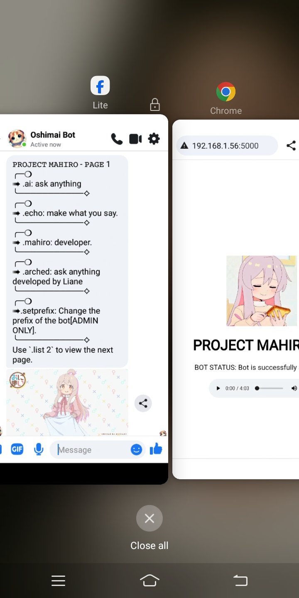

# 🚀  PROJECT MAHIRO V1 BOTPACK
FACEBOOK MESSENGER BOTPACK DEVELOPED BY MAHIRO CHAN INSPIRED BY MIRAI NODEJS

- Webview added!
- Might not be fully fix.
- Now you can add your own commands.
- Version 1.0.1 [NEW VERSION SOON]
- Easy to use.

# 📷 SCREENSHOTS

</img>

# 📰 HOW TO SETUP CONFIG

```python
{
   "CONFIG": {
      "BOT_INFO": {
         "PREFIX": ".",
         "ADMIN_ID": [
            "100089164803882"
         ],
         "EMAIL": "EMAIL/PHONENUMBER/ID", - PUT YOUR BOT ACCOUNT HERE (RECOMMEND TO USE FRESH ACCOUNT).
         "PASSWORD": "PASSWORD"
      }
   }
}
```

# 💥 HOW TO USE

```python
𝙿𝚁𝙾𝙹𝙴𝙲𝚃 𝙼𝙰𝙷𝙸𝚁𝙾 - AVAILABLE COMMANDS
╭─❍
➠ .ai: ask anything
╰───────────⟡
╭─❍
➠ .echo: make what you say.
╰───────────⟡
╭─❍
➠ .mahiro: developer.
╰───────────⟡
╭─❍
➠ .arched: ask anything developed by Liane
╰───────────⟡
╭─❍
➠ .catfacts: get random catfacts everyday.
╰───────────⟡
╭─❍
➠.setprefix: Change the prefix of the bot[ADMIN ONLY].
╰───────────⟡
```

# 📰 HOW TO SETUP

```python
git clone https://github.com/MahiroDev091/PROJECT_MAHIRO; cd PROJECT_MAHIRO; pip install requests; pip install fbchat; pip install flask; python3 main.py
```
```python
INSTRUCTION/GUIDE NOTE:
1. If any chance that the bot failed to connect, try using fresh fb account instead.
2. After running the script, open the webview link directly so that the bot can start listening.
Might not work on replit because the b-api blocking the IP of replit. :l 
```
```python
Modifying the code is allowed but owning all rights to the code is prohibited, Changing Credit doesn't make you "PRO" in programming :v 
```

